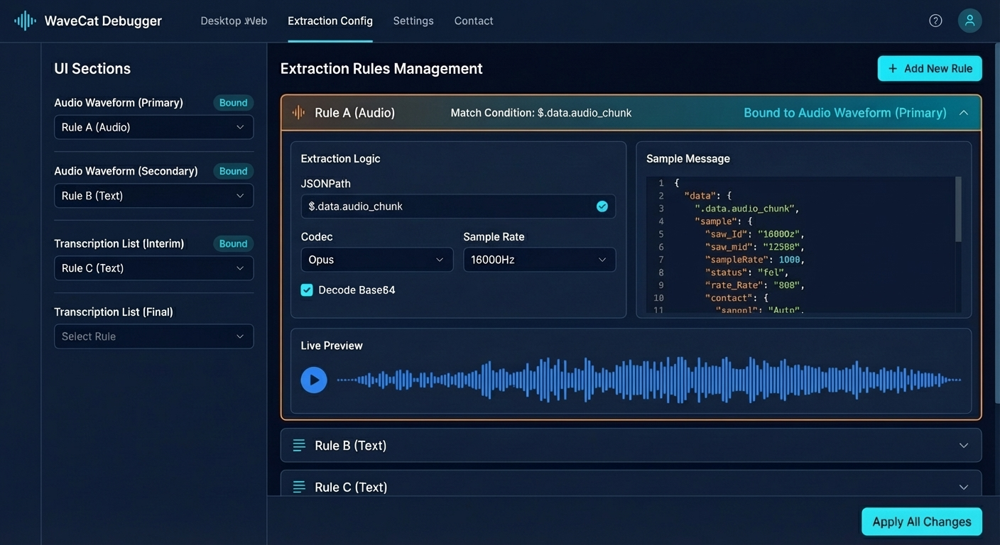
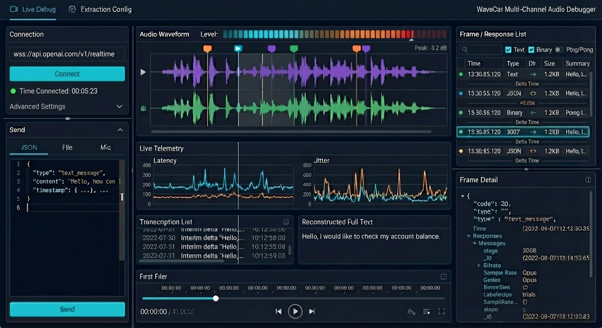

# WaveCat

WaveCat 是一个基于 Wails + React + TypeScript 的 AI Voice Debugger，用于 WebSocket 音频调试、帧观察与请求发送联调。

## 顶部导航界面预览

### 资源映射界面



### 调试界面



## 项目结构

- `frontend/`：前端工程（React + Vite + TypeScript）
- `internal/`：后端核心逻辑（audio / frame / ws）
- `ui/`：设计稿与效果图
- `docs/`：补充文档
- `build/`：打包产物与平台配置

## 快速开始

### 环境要求

- Go（建议 1.22+）
- Node.js（建议 18+）
- Wails CLI

安装 Wails CLI：

```bash
go install github.com/wailsapp/wails/v2/cmd/wails@latest
```

### 安装依赖

```bash
cd frontend
npm install
cd ..
```

### 本地开发

```bash
wails dev
```

启动后会开启前后端联调环境，前端由 Vite 提供热更新。

### 生产构建

```bash
wails build
```

## 常用命令

- `wails dev`：开发模式运行
- `wails build`：构建可分发应用

## 相关文档

- Wails 项目配置：<https://wails.io/docs/reference/project-config>
- 待办与问题跟踪：`todo.md`、`issues/`
